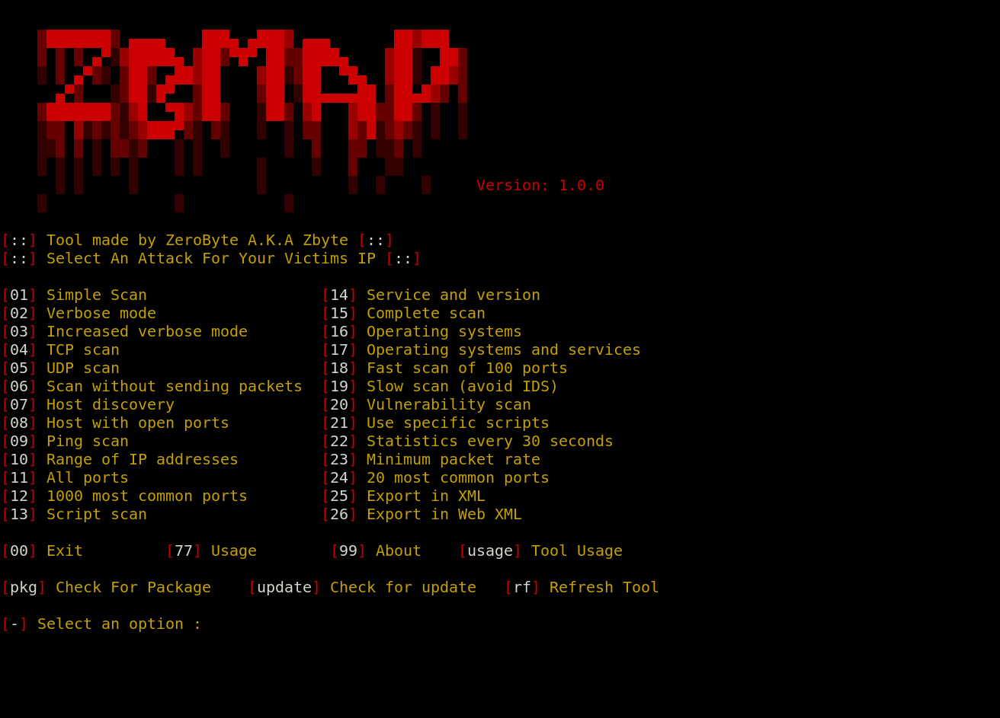

<p align="center" style="border: 1px solid black;">
    
</p>

<p align="center">
  
  
  
  
  
</p>

<p align="center">
  
  
  
  </a>
</p>

<br>
<h1 align="center"><b>ZBmap</b></h1>
<br>

<p><b> Any actions and or activities related to ZBmap is solely your responsibility. The misuse of this toolkit can result in criminal charges brought against the persons in question. The contributors will not be held responsible in the event any criminal charges be brought against any individuals misusing this toolkit to break the law.

This toolkit contains materials that can be potentially damaging or dangerous for social media. Refer to the laws in your province/country before accessing, using,or in any other way utilizing this in a wrong way.

This Tool is made for educational purposes only. Do not attempt to violate the law with anything contained here. If this is your intention, then Get the hell out of here!</b></p>

<h2 align="center"><b>The creator will not be responsible for the consequences caused by this tool!</b></h2>

# ZBmap

## Overview

ZBmap is a powerful and versatile IP scanning tool developed by ZeroByte, also known as Zbyte. This script-based utility is designed to facilitate network discovery and security assessments by providing users with a wide range of scanning options to identify live hosts, open ports, services running on those ports, and potential vulnerabilities within a network. Whether you are a network administrator, a security professional, or a penetration tester, ZBmap is an essential tool for performing thorough network reconnaissance.


## Purpose

The primary objective of ZBmap is to streamline the process of scanning IP addresses and ranges. It serves multiple purposes:

+ Network Discovery: Identify devices connected to a network, along with their IP addresses and open ports.
+ Service Enumeration: Determine the services and versions running on identified ports, aiding in identifying potential security risks.
+ Vulnerability Assessment: Utilize scripts to check for known vulnerabilities in services running on target hosts.
+ Performance Monitoring: Conduct periodic scans to track changes in network configurations or to monitor uptime.
## Features

**Extensive Scanning Options:**

ZBmap offers a comprehensive set of scanning options ranging from simple pings to complex service version detections. Users can choose the desired level of detail and specificity for their scans.

**Support for Various Protocols:**

The tool supports both TCP and UDP scans, allowing users to evaluate all aspects of their network.

**Customizable Scans:**

Users can perform targeted scans by specifying particular ports, using script scans for detailed service analysis, or conducting comprehensive scans across all ports.

**User-Friendly Interface:**

The interactive menu allows users to select scanning options easily, making it accessible even for those with limited command-line experience.
Export Capabilities:

ZBmap can export scan results in XML and web XML formats, facilitating further analysis or reporting.

**Vulnerability Scanning:**

By leveraging Nmap's scripting capabilities, ZBmap can check for vulnerabilities on the target hosts, helping users to secure their networks effectively.

**Verbose Output:**

The tool provides verbose and increased verbose options, giving users detailed information about the scanning process and results.

**Range Scanning:**

ZBmap allows scanning across a specified range of IP addresses, making it suitable for large networks.

**Periodic Statistics:**

Users can view statistics every 30 seconds during scans, offering real-time insight into the scanning process.
Functionality
When executed, ZBmap presents the user with a menu of scanning options. Each option corresponds to a specific type of scan or function, allowing for targeted reconnaissance:

+ Simple Scan: Quickly checks for live hosts on the network.
+ Verbose Mode: Provides detailed output during scans.
+ TCP and UDP Scans: Evaluates open ports and services for both TCP and UDP protocols.
+ Service and OS Detection: Identifies the services running on open ports and attempts to determine the operating systems of the scanned hosts.
+ Scripting Capabilities: Users can specify custom scripts to be executed against the target, enabling tailored assessments.
+ Usage Scenarios

**Network Administration:**

Administrators can use ZBmap to quickly identify devices on their network, monitor for unauthorized devices, and ensure that services are running as expected.

**Security Audits:**

Security professionals can employ ZBmap during vulnerability assessments to identify weaknesses in network configurations and service exposures.

**Penetration Testing:**

Penetration testers can utilize ZBmap as part of their reconnaissance phase to gather information about targets and identify potential attack vectors.

**Educational Purposes:**

Students and learners can use ZBmap to understand networking concepts, practice network scanning techniques, and learn about vulnerabilities in a controlled environment.
Technical Specifications
+ Dependencies: ZBmap relies on Nmap, a widely used network scanning tool, for performing the actual scans. Users must have Nmap installed on their systems for ZBmap to function correctly.

+ Supported Platforms: ZBmap is a shell script and can run on Unix-like operating systems, including Linux and macOS. It may also work in environments like Windows Subsystem for Linux (WSL).

+ Command-Line Interface: The script is designed for command-line usage, with input prompts for various parameters, ensuring a straightforward interaction model.

+ Color-Coded Output: The script employs ANSI escape codes for color-coded terminal output, enhancing readability and user experience.

**Getting Started**

**To use ZBmap, follow these steps:**

**Installation:**

Clone the repository or download the script to your local machine.
Ensure that Nmap is installed. You can install Nmap using your package manager (e.g., apt install nmap for Ubuntu).

**Permissions:**

Make the script executable by running: **chmod +x zbmap.sh.**

**Execution:**

Run the script in your terminal: **./zbmap.sh.**

Follow the on-screen prompts to select scanning options and enter target IP addresses.
Conclusion

ZBmap is an invaluable tool for anyone involved in network management and security. Its extensive features, coupled with a user-friendly interface, make it a preferred choice for performing IP scans and discovering potential vulnerabilities. By integrating ZBmap into your toolkit, you can enhance your network's security posture and ensure robust monitoring of connected devices.

# Clone the ZBmap Repository

**Locate the ZBmap Repository on GitHub:**

Open your web browser and navigate to the ZBmap GitHub repository. The URL will typically be in the following format:
arduino

https://github.com/tkemza/zbmap
or
[Tkemza github](https://github.com/tkemza)

**Copy the Repository URL:**

On the repository page, click on the green Code button.
You will see options to clone the repository using HTTPS, SSH, or GitHub CLI. For most users, it’s recommended to use the HTTPS option.
Click the clipboard icon next to the URL to copy it.

**Open Your Terminal or Command Prompt:**

On macOS or Linux, open the Terminal application.
On Windows, you can use Command Prompt or PowerShell.

**Change to the Desired Directory:**

Use the cd command to navigate to the directory where you want to clone the repository. For example:

```bash
cd ~/projects
``` 

**Clone the Repository:**

Execute the git clone command followed by the repository URL you copied earlier. Replace YourGitHubUsername with your actual GitHub username:
```bash
git clone --depth=1 https://github.com/tkemza/zbmap.git
```

**Navigate into the Cloned Directory:**

After cloning, change into the newly created directory to access your ZBmap files:
```bash 
cd zbmap
```

**You need to be root user to get access to the tool!**
```bash
sudo su
```

Then enter your password and from there run the tool.

Then to run the tool use 
```bash 
chmod +x zbmap.sh
```

Then

```bash
bash zbmap.sh
```

or

```bash
./zbmap.sh
```

# How to use ZBmap

When you run the tool you can enter 'usage' into terminal and get to 'usage menu' where you can find out how to use tool. 

# Preview

<p align="center" style="border: 1px solid black;">
    
</p>
